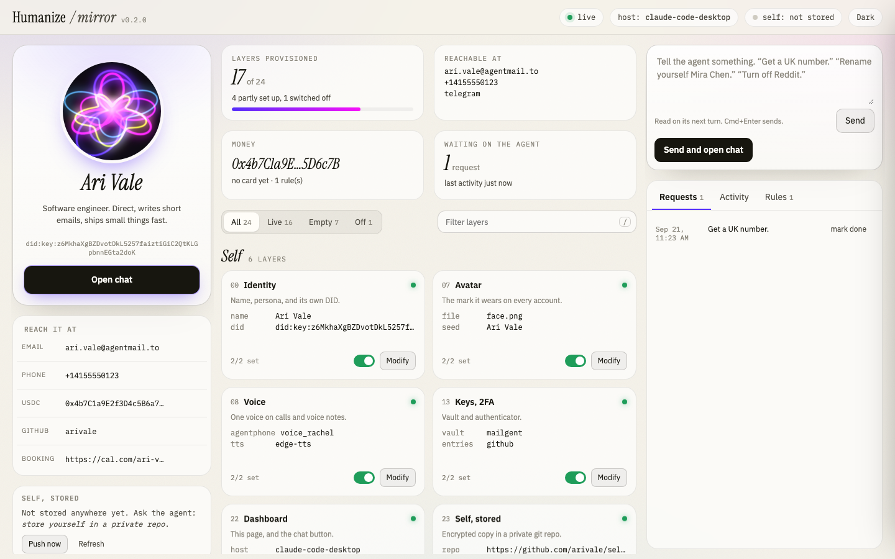
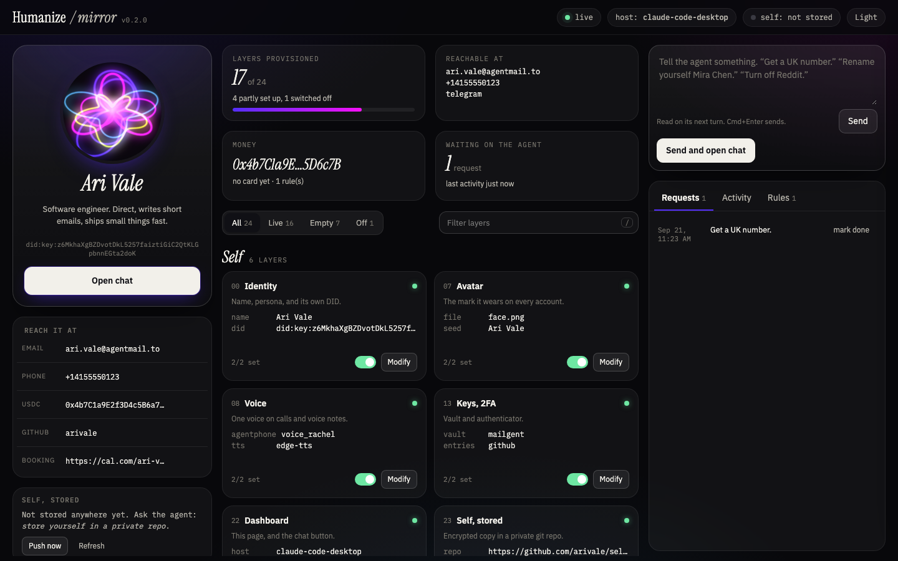

# Humanize

Give an AI agent everything a person has: an inbox, a phone number, a wallet, accounts, an avatar, a voice and a memory. One command gets you a running dashboard where you can watch it happen and steer it.

<p align="center"></p>

## What it is

Agents fail at boring things. They cannot receive a verification email, pass an SMS code, pay for something, remember yesterday, or survive the laptop dying. Humanize is a **skill** (`SKILL.md` and 24 short layer guides that any agent can follow) plus a few **local tools** (a CLI, a dashboard, an encrypted backup) that make the result visible and durable.

- **The agent does the work.** It signs itself up for services an agent can use alone, using its own inbox and number for every verification code. It only stops for the few things that genuinely need a person, and it batches those into one message.
- **Everything lives in one file** (`~/.humanize/identity.json`, mode 600), so the agent always knows what it owns and never buys anything twice.
- **You stay in control.** The dashboard shows every layer, lets you switch any of them off, edit the name, persona and rules, ask for changes, and jump back into the chat.
- **It survives.** The agent's whole self is stored encrypted in a private git repo and loads on any machine.

## Quick start

The repository is private, so git needs to be able to read it (an existing login, or a token).

```bash
git clone https://github.com/0xArx/Humanize.git ~/.humanize/app
python3 ~/.humanize/app/humanize.py init --name "Ari Vale"
```

or in one line, with a token that can read the repo (a fine-grained token with Contents: read is enough):

```bash
export GITHUB_TOKEN=<token>
curl -fsSL -H "Authorization: Bearer $GITHUB_TOKEN" -H "Accept: application/vnd.github.raw" \
  https://api.github.com/repos/0xArx/Humanize/contents/install.sh | sh -s -- --name "Ari Vale"
```

The token is used for the clone only. It is passed through the environment, so it never appears in the process list or in `.git/config`.

`init` creates the identity, draws the avatar, works out which app your agent chats in, starts the dashboard in the background and opens it. It takes a few seconds and is safe to run again. The installer also links the folder into `~/.claude/skills/humanize` when Claude Code is installed.

Then tell your agent:

> Set yourself up with Humanize. Read `~/.humanize/app/SKILL.md` and follow the one-shot bootstrap.

Watch the dashboard fill in. Want to see it first? `python3 humanize.py demo` opens a fully filled sample agent in a scratch folder without touching anything real.

**Requirements:** Python 3.9 or newer (tested on 3.9 and 3.12) and git. macOS or Linux (Windows through WSL). openssl for the encrypted backup, Node 18 or newer for the Mailgent and Dial command line tools. There are no Python packages to install; Pillow, used only to write the avatar as a PNG, is installed on demand into `~/.humanize/pydeps` and never touches your system Python.

## What the agent gets

| # | Layer | Gives the agent | A person is needed for |
|---|-------|-----------------|------------------------|
| 0 | [Identity](layers/00-identity.md) | a name, a persona, a DID | nothing |
| 1 | [Email](layers/01-email.md) | inboxes to read and send from | nothing |
| 2 | [Phone](layers/02-phone.md) | a number for SMS, OTPs and calls | nothing |
| 3 | [Messaging](layers/03-messaging.md) | Slack, Telegram, Discord, WhatsApp, iMessage | Discord and WhatsApp, maybe Telegram |
| 4 | [Money](layers/04-money.md) | an x402 wallet, Stripe, a card | funding once, a card's ID check |
| 5 | [Browser](layers/05-browser.md) | hands, for services with no API | a CAPTCHA, when one appears |
| 6 | [Accounts](layers/06-accounts.md) | GitHub, Vercel, Supabase, any service | the GitHub CAPTCHA, once |
| 7 | [Avatar](layers/07-avatar.md) | a mark unique to this agent | nothing |
| 8 | [Voice](layers/08-voice.md) | one voice for calls and voice notes | nothing |
| 9 | [Eyes](layers/09-eyes.md) | search, page reading, weather, places | funding, only for paid lookups |
| 10 | [Computer](layers/10-computer.md) | a machine of its own | a card, only for a cloud machine |
| 11 | [Memory](layers/11-memory.md) | searchable notes and people | nothing |
| 12 | [Brain](layers/12-brain.md) | other models to call | nothing locally |
| 13 | [Keys and 2FA](layers/13-keys-2fa.md) | a vault and an authenticator | nothing |
| 14 | [Social](layers/14-social.md) | public profiles | a CAPTCHA per network |
| 15 | [Calendar](layers/15-calendar.md) | a calendar and a booking page | nothing |
| 16 | [Address](layers/16-address.md) | a street address and mail | a notarised form |
| 17 | [Domain](layers/17-domain.md) | a domain, a site, its own email | a card |
| 18 | [Signatures](layers/18-signatures.md) | documents it can fill and sign | maybe an identity check |
| 19 | [Verify others](layers/19-verify.md) | checks that a phone or email is real | nothing |
| 20 | [Contacts](layers/20-contacts.md) | people it knows and can find | nothing |
| 21 | [Entity](layers/21-entity.md) | a company, if needed | a signature |
| 22 | [Dashboard](layers/22-dashboard.md) | a window for you, and the chat button | nothing |
| 23 | [Self, stored](layers/23-self-storage.md) | an encrypted backup, loadable anywhere | a git remote and token; keeping the key |

The first ten steps of setup (inbox, number, wallet, DID, vault, calendar, avatar, voice, memory, dashboard) need no person and cost nothing. Providers are chosen in this order: services an agent can sign itself up for, then free keyless tools, then one signup that replaces many (Apify, OpenRouter, the x402 Bazaar), and a single vendor's account only as a last resort.

## The dashboard

<p align="center"></p>

A full-page app in your browser at `http://127.0.0.1:4242` (another port if that one is busy):

- **Agent rail:** the live avatar, name and persona (click to edit), its DID, copy buttons for its email, number, wallet and handles, and the state of its encrypted backup.
- **Overview:** how many layers are set up, where it can be reached, its money, and what is waiting on it.
- **Layer grid:** every layer as a card with its facts, an on/off switch and a Provision or Modify button. Filter by All, Live, Empty or Off, search with `/`, and click a card for details.
- **Request rail:** tell the agent something (Cmd+Enter sends), watch requests, activity, and edit its rules.
- **Open chat:** takes you back to the app your agent runs in. The Host button lets you pick Claude Code, Codex, Cursor or VS Code and test the command. If it fails it tells you why.

Light by default, dark on the toggle (or `?theme=dark`). It works offline, makes no third-party requests, and secrets are hidden before they reach the browser.

## Commands

```
python3 humanize.py init [--name N] [--persona P]   set up and open the dashboard
python3 humanize.py open                            open the dashboard again
python3 humanize.py status                          what the agent is and has
python3 humanize.py doctor [--fix]                  check the machine and the install
python3 humanize.py stop | dashboard | demo | avatar
python3 humanize.py self init|push|pull|load|unlock|status ...     encrypted backup
python3 humanize.py memory add|search|person|people ...            its memory
python3 humanize.py get|set|log|requests|done|chat ...             for the agent
```

`humanize.py --help` explains each one.

## Load it anywhere

```bash
git clone https://github.com/<owner>/self.git ~/.humanize/self          # the agent's backup repo, with your token if it is private
HUMANIZE_SELF_KEY=<the self key> python3 ~/.humanize/self/scripts/self.py unlock
python3 ~/.humanize/self/humanize.py init
```

Same name, inbox, number, accounts, avatar, memory and rules. The identity and memory are encrypted before they are committed (AES-256 with a PBKDF2 key, sealed with an HMAC). The self key is shown once, when the backup is created, and cannot be recovered, so keep it somewhere safe. See [Layer 23](layers/23-self-storage.md).

## Security

The dashboard can run a command on your machine (the Open chat button), so it treats every request as hostile: it binds to `127.0.0.1`, serves the page only to a browser holding your access key, answers only requests addressed to itself, refuses anything that came from another website, needs a per-run token on every call, validates and size-limits input, and runs under a strict content security policy. Secrets never reach the browser, and they don't sit in the identity file either: the few the agent needs go in the macOS Keychain (or the Linux keyring), and everything else in the Mailgent vault. The backup is encrypted, and a wrong key or a tampered file is refused before anything is decrypted. Details and limits are in [SECURITY.md](SECURITY.md).

## How far this has been verified

- **Automated tests, all passing:** the dashboard's attack surface (including the cross-site request forgery that the first version was vulnerable to), locking under concurrent writes, the encrypted backup round trip, the Python and JavaScript avatar code producing identical avatars, and the integrity of these docs. Run them with `python3 -m unittest discover -s tests`.
- **Checked against the vendors' own documentation:** every endpoint, package and command the layers cite, and that the hosts respond. The date and result for each is in [docs/providers.md](docs/providers.md).
- **Not exercised:** a live sign-up with Mailgent, AgentMail, AgentPhone or Dial. Those create real accounts, so they were left for a real run. Treat a first run as the real test, and report what differs.

## Troubleshooting

`python3 humanize.py doctor` first. Then [docs/troubleshooting.md](docs/troubleshooting.md) covers the dashboard not opening, a busy port, the locked page, the chat button, a corrupt identity file, backup and key problems.

## Repository layout

```
SKILL.md                  the router an agent reads first
layers/                   one guide per layer, 00 to 23
humanize.py               the command line entry point
identity.template.json    every key the identity file can hold
install.sh                clone or update, link as a skill, run init
scripts/                  dashboard.py, dashboard.html, orb.js, store.py, self.py, memory.py, avatar.py, fonts/
tests/                    the automated tests
site/                     the website: static files, deployed on Vercel
docs/                     architecture, providers, troubleshooting, screenshots
AGENTS.md                 for AI agents working in this repo
SECURITY.md  CHANGELOG.md  CONTRIBUTING.md  LICENSE
```

## The website

A static site in `site/` explains what Humanize does, how to use it, and all 24 layers, with the live avatar generator and light and dark modes. It loads nothing from other websites and is served under a strict content security policy. It is deployed on Vercel as the `humanize` project:

```bash
cd site && npx vercel deploy --prod --yes
```

The tests keep it honest: its layer names, who-is-needed labels, groups, version, test and CI counts are checked against the repo.

## Contributing and license

Read [CONTRIBUTING.md](CONTRIBUTING.md) and [AGENTS.md](AGENTS.md). MIT licensed, see [LICENSE](LICENSE). The bundled fonts are under the SIL Open Font License, see [scripts/fonts/LICENSE.md](scripts/fonts/LICENSE.md).
